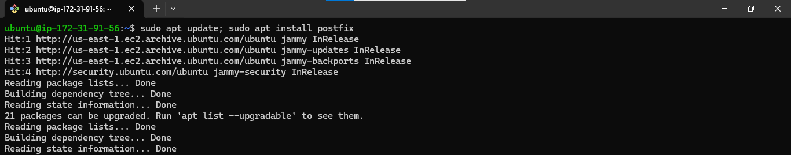
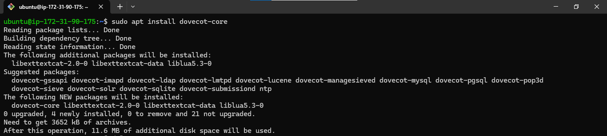
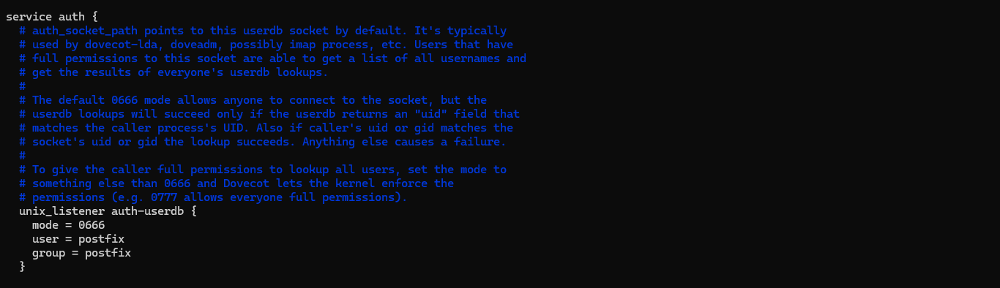

## **How to Install and Set Up Mail Server (postfix) on Ubuntu Version 20.04 LTS 0r Higher**

Postfix is the default mail transfer agent (MTA) in Ubuntu. It is designed to be fast, secure, and easy to administer. Postfix is compatible with the MTA sendmail, and this section will explain how to install and configure Postfix for secure communications.

- Postfix is the default MTA in Ubuntu.

- Postfix is designed to be fast, secure, and easy to administer.
- Postfix is compatible with sendmail.
- This section will explain how to install and configure Postfix for secure communications.

# **Requirements to install Mail Server**

- Ubuntu 20.04 0r higher

## **Step 1: Installation**

To install Mail Server, firstly, update your machine and then, install `postfix` using the following command:

**NOTE: Keep the Basic Configurations at default**

    sudo apt update; sudo apt isnatll postfix -y

There are two ways to set the mailbox format: editing the configuration file directly, or using the postconf command. The configuration parameters are stored in the /etc/postfix/main.cf file. If you need to change a configuration parameter later, you can either run the postconf command again, or edit the file manually.

To configure the mailbox format for Maildir:

    sudo postconf -e 'home_mailbox = Maildir/'

## **Step 2: SMTP Authentication**
SMTP-AUTH is a protocol that allows a client to identify itself to an SMTP server. The client authenticates itself using the SASL authentication mechanism, which encrypts the authentication process using Transport Layer Security (TLS). Once authenticated, the SMTP server will allow the client to relay mail.

To configure Postfix for SMTP-AUTH using SASL (Dovecot SASL), run the following commands at a terminal prompt:

    sudo postconf -e 'smtpd_sasl_type = dovecot'
    sudo postconf -e 'smtpd_sasl_path = private/auth'
    sudo postconf -e 'smtpd_sasl_local_domain ='
    sudo postconf -e 'smtpd_sasl_security_options = noanonymous,noplaintext'
    sudo postconf -e 'smtpd_sasl_tls_security_options = noanonymous'
    sudo postconf -e 'broken_sasl_auth_clients = yes'
    sudo postconf -e 'smtpd_sasl_auth_enable = yes'
    sudo postconf -e 'smtpd_recipient_restrictions = permit_sasl_authenticated,permit_mynetworks,reject_unauth_destination'

After the initial configuration is complete, you can restart the postfix daemon by running the following command:

    sudo systemctl restart postfix

## **Step 2: Configuring SASL** ##

To enable Dovecot SASL, you need to install the dovecot-core package.

    sudo apt install dovecot-core

Next, edit /etc/dovecot/conf.d/10-master.conf and change the following:

Once you have Dovecot configured, restart it with:

    sudo systemctl restart dovecot.service

## **Step 3: Testing**
SMTP-AUTH configuration is complete. Now it is time to test the setup.

To see if SMTP-AUTH and TLS work properly, run the following command:

    telnet ip-172-31-91-56.ec2.internal 25

---

## 🔗 Contacts

## MICHAEL AGBIAOWEI

