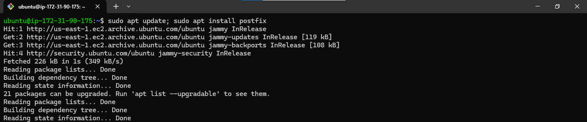

## **How to Install and Set Up Mail Server (postfix) on Ubuntu Version 20.04 LTS 0r Higher**

Postfix is the default mail transfer agent (MTA) in Ubuntu. It is designed to be fast, secure, and easy to administer. Postfix is compatible with the MTA sendmail, and this section will explain how to install and configure Postfix for secure communications.

- Postfix is the default MTA in Ubuntu.

- Postfix is designed to be fast, secure, and easy to administer.
- Postfix is compatible with sendmail.
- This section will explain how to install and configure Postfix for secure communications.

# **Requirements to install Mail Server**

- Ubuntu 20.04 0r higher

## **Step 1: Installation**

To install Mail Server, firstly, update your machine and then, install `postfix` using the following command:

**NOTE: Use the default settings for the basic configurations**

    sudo apt update; sudo apt isnatll postfix -y

There are two ways to set the mailbox format: editing the configuration file directly, or using the postconf command. The configuration parameters are stored in the /etc/postfix/main.cf file. If you need to change a configuration parameter later, you can either run the postconf command again, or edit the file manually.

To configure the mailbox format for Maildir:

    sudo postconf -e 'home_mailbox = Maildir/'

## **Step 2: Testing**
SMTP-AUTH configuration is complete. Now it is time to test the setup.

To see if SMTP-AUTH and TLS work properly, run the following command:

    hostname -f

    telnet ip-172-31-90-175.ec2.internal 25

After you have established the connection to the Postfix mail server, type:

    ehlo ip-172-31-90-175.ec2.internal

If you see the following in the output, then everything is working perfectly. Type quit to exit.

## **Step 3: SMTP Authentication**
SMTP-AUTH is a protocol that allows a client to identify itself to an SMTP server. The client authenticates itself using the SASL authentication mechanism, which encrypts the authentication process using Transport Layer Security (TLS). Once authenticated, the SMTP server will allow the client to relay mail.

To configure Postfix for SMTP-AUTH using SASL (Dovecot SASL), run the following commands at a terminal prompt:

    sudo postconf -e 'smtpd_sasl_type = dovecot'
    sudo postconf -e 'smtpd_sasl_path = private/auth'
    sudo postconf -e 'smtpd_sasl_local_domain ='
    sudo postconf -e 'smtpd_sasl_security_options = noanonymous,noplaintext'
    sudo postconf -e 'smtpd_sasl_tls_security_options = noanonymous'
    sudo postconf -e 'broken_sasl_auth_clients = yes'
    sudo postconf -e 'smtpd_sasl_auth_enable = yes'
    sudo postconf -e 'smtpd_recipient_restrictions = permit_sasl_authenticated,permit_mynetworks,reject_unauth_destination'

Now, the file /etc/postfix/main.cf should look like this:

    # See /usr/share/postfix/main.cf.dist for a commented, more complete version

    # Debian specific:  Specifying a file name will cause the first
    # line of that file to be used as the name.  The Debian default
    # is /etc/mailname.
    #myorigin = /etc/mailname

    smtpd_banner = $myhostname ESMTP $mail_name (Ubuntu)
    biff = no

    # appending .domain is the MUA's job.
    append_dot_mydomain = no

    # Uncomment the next line to generate "delayed mail" warnings
    #delay_warning_time = 4h

    readme_directory = no

    # See http://www.postfix.org/COMPATIBILITY_README.html -- default to 3.6 on
    # fresh installs.
    compatibility_level = 3.6

    # TLS parameters
    smtpd_tls_cert_file=/etc/ssl/certs/ssl-cert-snakeoil.pem
    smtpd_tls_key_file=/etc/ssl/private/ssl-cert-snakeoil.key
    smtpd_tls_security_level=may

    smtp_tls_CApath=/etc/ssl/certs
    smtp_tls_security_level=may
    smtp_tls_session_cache_database = btree:${data_directory}/smtp_scache

    smtpd_relay_restrictions = permit_mynetworks permit_sasl_authenticated defer_unauth_destination
    myhostname = ip-172-31-90-175.ec2.internal
    alias_maps = hash:/etc/aliases
    alias_database = hash:/etc/aliases
    myorigin = /etc/mailname
    mydestination = $myhostname, ip-172-31-90-175.ec2.internal, localhost.ec2.internal, , localhost
    relayhost =
    mynetworks = 127.0.0.0/8 [::ffff:127.0.0.0]/104 [::1]/128
    mailbox_size_limit = 0
    recipient_delimiter = +
    inet_interfaces = all
    inet_protocols = all
    home_mailbox = Maildir/
    smtpd_sasl_type = dovecot
    smtpd_sasl_path = private/auth
    smtpd_sasl_local_domain =
    smtpd_sasl_security_options = noanonymous,noplaintext
    smtpd_sasl_tls_security_options = noanonymous
    broken_sasl_auth_clients = yes
    smtpd_sasl_auth_enable = yes
    smtpd_recipient_restrictions = permit_sasl_authenticated,permit_mynetworks,reject_unauth_destination

After the initial configuration is complete, you can restart the postfix daemon by running the following command:

    sudo systemctl restart postfix

## **Step 4: Configuring SASL** ##

To enable Dovecot SASL, you need to install the dovecot-core package.

    sudo apt install dovecot-core

Next, edit /etc/dovecot/conf.d/10-master.conf and change the following:

Once you have Dovecot configured, restart it with:

    sudo systemctl restart dovecot.service

---

## 🔗 Contacts

## MICHAEL AGBIAOWEI

